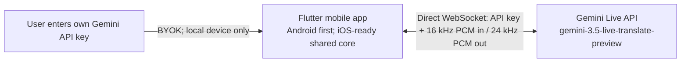

# realtime-translation

Android-first, cross-platform, ultra-low-latency, two-way speech translation for face-to-face travel conversations, powered by the Google Gemini Live API and `gemini-3.5-live-translate-preview`.

> Status: Android-first `0.5.0` preview. The app, bounded native Android audio path, real Gemini speech/text/audio pipeline, interruption-safe speaker switching, system-audio interruption handling, and privacy-safe runtime diagnostics are runnable; physical-device acoustic and latency hardening remains before a production release.

## Product direction

- Natural, bidirectional speech-to-speech translation for two people sharing one phone.
- Live source and translated transcripts for noisy places and accessibility.
- Fast direction switching without reconnecting the whole application.
- Mobile-first interaction with large controls, a face-to-face reading mode, and resilient reconnect behavior.
- Bring your own API key (BYOK): the user enters a Gemini API key in the app; without a valid key, translation cannot start.

## Why this is a new repository

The initial open-source survey found mature real-time translation projects, but none that combine all of the following: mobile-first travel UX, native Gemini 3.5 Live Translate, two-way face-to-face conversation, secure client authentication, and a permissive foundation suitable for focused product development.

The closest projects are documented in [the open-source landscape report](docs/research/open-source-landscape.md). We are starting with a clean Apache-2.0 repository and using Google's official protocol and examples as references instead of forking a mismatched desktop or broadcast product.

## MVP architecture



There is no application backend, account system, or media relay. The user owns the API key and usage charges. The app must never hard-code, upload, log, or commit the key; it uses the key only to connect directly to Gemini from the user's device.

## Core interaction

1. Enter and validate a Gemini API key.
2. Choose language A and language B.
3. Tap person A or person B to select the current speaker.
4. Speak; the app shows the original text and translated text while playing translated speech.
5. Tap the other person when the speaker changes.

Automatic speaker/direction detection is intentionally out of scope. The user always controls who is currently speaking.

## Repository layout

```text
lib/
  app/              # Material 3 application and dependency wiring
  conversation/     # Shared speaker/direction and transcript state
  live_translate/   # Gemini protocol, sessions, reconnect/resumption
  audio/            # Platform-neutral audio contracts and queues
android/             # Android host and low-latency Kotlin audio adapter
ios/                 # iOS host prepared for the later Swift audio adapter
docs/
  research/         # Source-backed technical investigations
```

Flutter is the accepted application framework. Android is the first implementation and release target; iOS follows after the Android MVP. Shared Dart code must not import Android-specific APIs, and the audio/key/lifecycle boundaries are platform interfaces from the first spike so the later iOS implementation can reuse the product and protocol layers.

## Current technical facts

- Model: `gemini-3.5-live-translate-preview` (preview).
- Input: raw signed 16-bit PCM, 16 kHz, mono, little-endian.
- Output: raw signed 16-bit PCM, 24 kHz, mono, little-endian.
- Recommended input chunk size: 100 ms.
- Translation input is audio-only; output can include translated audio plus source/target transcripts.
- More than 70 languages are supported by the current preview.

See the [Google Live Translation guide](https://ai.google.dev/gemini-api/docs/live-api/live-translate) for the current API contract.

## Implemented through 0.5.0

- Direct BYOK WebSocket connection to `gemini-3.5-live-translate-preview` with no application backend.
- Source transcript, translated transcript, and translated 24 kHz PCM audio output.
- Manual A/B speaker selection backed by two warm directional sessions.
- Speaker changes immediately discard speech queued for the previous direction,
  reset echo suppression, and reopen capture only after the new direction is
  ready, so users can actively interrupt a long translation.
- More than 70 searchable target languages using the official BCP-47 list.
- Standard conversation and face-to-face reading layouts, mute, history, and interruption-safe stop behavior.
- Android 16 kHz microphone capture plus serialized native `AudioTrack`
  playback capped at 1.5 seconds of queued audio.
- Memory-only key use by default and opt-in OS-backed secure storage.
- Setup timeout, bounded reconnect, terminal/retryable error classification,
  session resumption, `goAway`, and redacted user errors.
- Lifecycle cancellation, stale-direction protection, bounded transcripts, and
  the latest 200 conversation turns retained in memory.
- Redacted in-app diagnostics for first-output latency, capture/echo suppression,
  reconnect/failure counts, direction switches, completed turns, and native
  playback queue depth/drops. Reports contain no key, audio, or transcript text.
- Terminal session/audio failures automatically release capture, both warm
  sessions, and playback before the user can retry.
- Android uses one app-level audio-focus owner. Calls or other focus owners stop
  capture and both Gemini sessions immediately; manual/lifecycle stops release
  `AudioTrack`, communication mode, and focus before a later clean restart.
- Diagnostics report the last actual output route, current focus ownership, and
  system-interruption count without exposing key, audio, or transcript content.

## Quick start

```bash
git clone https://github.com/lem923/gemini-realtime-translation-for-mobile.git
cd gemini-realtime-translation-for-mobile
flutter pub get
flutter run
```

Enter your own Google AI Studio key in the app. The key's project must be able to use `gemini-3.5-live-translate-preview`. See [QUICKSTART.md](QUICKSTART.md) for Android setup, tests, APK builds, and safe live smoke testing.

## Validation status

- `flutter analyze`: clean.
- 36 automated protocol, session, PCM, transcript, controller, diagnostics, and
  responsive widget tests: passing.
- Real API smoke: 16 kHz speech input produced source text, translated text, and 24 kHz audio.
- Android API 36 emulator: install, cold start, Key validation, microphone
  permission, start/stop, live session readiness, ten rapid A/B switches during
  translated-audio output, language search, mute, and both layouts exercised
  without application crashes or playback/session errors.
- Android API 36 audio-focus integration: active focus and speaker route
  observed; manual stop released focus/recording; clean restart succeeded; an
  external foreground service then took focus and the app stopped capture and
  sessions while remaining foreground, with zero session/playback errors.
- The preview APK is signed with a dedicated external release key and verified
  with Android's v2 signature scheme and 16 KB page alignment.
- Still required before a production release: representative physical Android
  phones, real microphone/speaker echo tests, Bluetooth/wired routes,
  weak-network measurements, and the later iOS audio implementation.

## Project management

Alcove manages private working documentation for PRD, architecture, decisions, progress, debt, conventions, and secret-handling rules. Public findings that are safe and useful to contributors live under `docs/`.

## License

Apache License 2.0. See [LICENSE](LICENSE).
