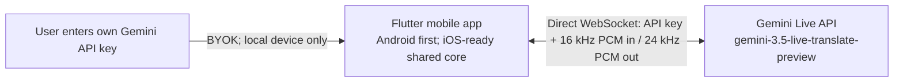

# realtime-translation

Android-first, cross-platform, ultra-low-latency, two-way speech translation for face-to-face travel conversations, powered by the Google Gemini Live API and `gemini-3.5-live-translate-preview`.

> Status: Phase 0 — foundation and technical validation. No production app has been released yet.

## Product direction

- Natural, bidirectional speech-to-speech translation for two people sharing one phone.
- Live source and translated transcripts for noisy places and accessibility.
- Fast direction switching without reconnecting the whole application.
- Mobile-first interaction with large controls, a face-to-face reading mode, and resilient reconnect behavior.
- Bring your own API key (BYOK): the user enters a Gemini API key in the app; without a valid key, translation cannot start.

## Why this is a new repository

The initial open-source survey found mature real-time translation projects, but none that combine all of the following: mobile-first travel UX, native Gemini 3.5 Live Translate, two-way face-to-face conversation, secure client authentication, and a permissive foundation suitable for focused product development.

The closest projects are documented in [the open-source landscape report](docs/research/open-source-landscape.md). We are starting with a clean Apache-2.0 repository and using Google's official protocol and examples as references instead of forking a mismatched desktop or broadcast product.

## MVP architecture



There is no application backend, account system, or media relay. The user owns the API key and usage charges. The app must never hard-code, upload, log, or commit the key; it uses the key only to connect directly to Gemini from the user's device.

## Core interaction

1. Enter and validate a Gemini API key.
2. Choose language A and language B.
3. Tap person A or person B to select the current speaker.
4. Speak; the app shows the original text and translated text while playing translated speech.
5. Tap the other person when the speaker changes.

Automatic speaker/direction detection is intentionally out of scope. The user always controls who is currently speaking.

## Planned repository layout

```text
lib/
  app/              # Flutter UI, navigation, settings
  conversation/     # Shared speaker/direction and transcript state
  live_translate/   # Gemini protocol, sessions, reconnect/resumption
  audio/            # Platform-neutral audio contracts and queues
android/             # Android host and low-latency Kotlin audio adapter
ios/                 # iOS host and Swift audio adapter contract/stubs
docs/
  research/         # Source-backed technical investigations
```

Flutter is the accepted application framework. Android is the first implementation and release target; iOS follows after the Android MVP. Shared Dart code must not import Android-specific APIs, and the audio/key/lifecycle boundaries are platform interfaces from the first spike so the later iOS implementation can reuse the product and protocol layers.

## Current technical facts

- Model: `gemini-3.5-live-translate-preview` (preview).
- Input: raw signed 16-bit PCM, 16 kHz, mono, little-endian.
- Output: raw signed 16-bit PCM, 24 kHz, mono, little-endian.
- Recommended input chunk size: 100 ms.
- Translation input is audio-only; output can include translated audio plus source/target transcripts.
- More than 70 languages are supported by the current preview.

See the [Google Live Translation guide](https://ai.google.dev/gemini-api/docs/live-api/live-translate) for the current API contract.

## Quick start

There is no runnable application in Phase 0. See [QUICKSTART.md](QUICKSTART.md) for repository setup and the validation plan.

## Project management

Alcove manages private working documentation for PRD, architecture, decisions, progress, debt, conventions, and secret-handling rules. Public findings that are safe and useful to contributors live under `docs/`.

## License

Apache License 2.0. See [LICENSE](LICENSE).
