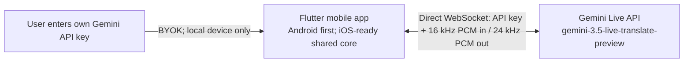

# realtime-translation

Android-first, cross-platform, ultra-low-latency, two-way speech translation for face-to-face travel conversations, powered by the Google Gemini Live API and `gemini-3.5-live-translate-preview`.

> Status: Android-first `0.16.0` preview. The app, generation-isolated and health-checked native Android communication capture/playback path, external-device-aware routing, real Gemini speech/text/audio pipeline, listener-facing face-to-face translation, interruption-safe speaker switching, translated-audio replay, persisted language-pair preferences, typed offline/quota/permission recovery states, explicit audio-stream boundaries, long-session context compression, system-audio interruption handling, and privacy-safe runtime diagnostics are runnable; physical-device acoustic and latency hardening remains before a production release.

## Product direction

- Natural, bidirectional speech-to-speech translation for two people sharing one phone.
- Live source and translated transcripts for noisy places and accessibility.
- Fast direction switching without reconnecting the whole application.
- Mobile-first interaction with large controls, a face-to-face reading mode, and resilient reconnect behavior.
- Bring your own API key (BYOK): the user enters a Gemini API key in the app; without a valid key, translation cannot start.

## Why this is a new repository

The initial open-source survey found mature real-time translation projects, but none that combine all of the following: mobile-first travel UX, native Gemini 3.5 Live Translate, two-way face-to-face conversation, secure client authentication, and a permissive foundation suitable for focused product development.

The closest projects are documented in [the open-source landscape report](docs/research/open-source-landscape.md). We are starting with a clean Apache-2.0 repository and using Google's official protocol and examples as references instead of forking a mismatched desktop or broadcast product.

## MVP architecture



There is no application backend, account system, or media relay. The user owns the API key and usage charges. The app must never hard-code, upload, log, or commit the key; it uses the key only to connect directly to Gemini from the user's device.

## Core interaction

1. Enter and validate a Gemini API key.
2. Choose language A and language B.
3. Tap person A or person B to select the current speaker.
4. Speak; the app shows the original text and translated text while playing translated speech.
5. Tap the other person when the speaker changes.

Automatic speaker/direction detection is intentionally out of scope. The user always controls who is currently speaking.

## Repository layout

```text
lib/
  app/              # Material 3 application and dependency wiring
  conversation/     # Shared speaker/direction and transcript state
  live_translate/   # Gemini protocol, sessions, reconnect/resumption
  audio/            # Platform-neutral audio contracts and queues
  permissions/      # Platform-neutral permission status/events/settings
android/             # Android host and low-latency Kotlin audio adapter
ios/                 # iOS host prepared for the later Swift audio adapter
docs/
  research/         # Source-backed technical investigations
```

Flutter is the accepted application framework. Android is the first implementation and release target; iOS follows after the Android MVP. Shared Dart code must not import Android-specific APIs, and the audio/key/lifecycle boundaries are platform interfaces from the first spike so the later iOS implementation can reuse the product and protocol layers.

## Current technical facts

- Model: `gemini-3.5-live-translate-preview` (preview).
- Input: raw signed 16-bit PCM, 16 kHz, mono, little-endian.
- Output: raw signed 16-bit PCM, 24 kHz, mono, little-endian.
- Recommended input chunk size: 100 ms.
- Translation input is audio-only; output can include translated audio plus source/target transcripts.
- More than 70 languages are supported by the current preview.

See the [Google Live Translation guide](https://ai.google.dev/gemini-api/docs/live-api/live-translate) for the current API contract.

## Implemented through 0.16.0

- Direct BYOK WebSocket connection to `gemini-3.5-live-translate-preview` with no application backend.
- Source transcript, translated transcript, and translated 24 kHz PCM audio output.
- Manual A/B speaker selection backed by two warm directional sessions.
- Speaker changes immediately discard speech queued for the previous direction,
  reset echo suppression, and reopen capture only after the new direction is
  ready, so users can actively interrupt a long translation.
- Speaker changes and stops send the Live API's `audioStreamEnd` boundary, and
  late text/audio/completion events from the now-inactive directional session
  are discarded instead of leaking into the next turn.
- More than 70 searchable target languages using the official BCP-47 list.
- The last valid A/B language pair is restored across restarts and upgrades from
  one non-sensitive local preference; conversation text and audio remain memory-only.
- Standard conversation and face-to-face reading layouts, mute, history, and interruption-safe stop behavior. In face-to-face mode, the selected speaker sees the live source transcript while the opposite listener sees the translated transcript; the completed pair stays visible until the next utterance or direction change.
- Per-turn translated-audio replay from a memory-only bounded cache: 30 seconds
  maximum per turn, 8 MiB total, oldest-audio eviction without deleting text,
  and immediate cancellation on mute, clear, speaker switch, stop, or fresh live output.
- Android 16 kHz microphone capture explicitly uses the voice-communication
  source and speech preprocessing, while serialized native `AudioTrack`
  playback is capped at 1.5 seconds of queued audio.
- Listening readiness requires an actual complete PCM chunk within three
  seconds. Native initialization errors and silent capture fail closed with a
  microphone-specific recovery message, while the verified first chunk remains
  buffered for Gemini.
- Memory-only key use by default and opt-in OS-backed secure storage.
- Setup timeout, bounded reconnect, terminal/retryable error classification,
  session resumption, `goAway`, sliding-window context compression, and redacted
  user errors.
- Material status and recovery actions distinguish listening, translating,
  reconnecting, offline, rate-limited, permission-denied, and failed states;
  connecting/reconnecting can always be cancelled explicitly.
- Microphone status is observed without prompting and distinguishes a first
  request from a real denial across cold starts. Runtime revocation stops all
  media resources; the denied state opens the native app settings page and
  restores readiness after the user grants access and returns.
- Dynamic status/error announcements, explicit face-to-face speaker semantics,
  and at least 48 px language/settings targets improve screen-reader and touch use.
- Lifecycle cancellation, stale-direction protection, bounded transcripts, and
  the latest 200 conversation turns retained in memory.
- Redacted in-app diagnostics for first-output latency, capture/echo suppression,
  reconnect/failure counts, direction switches, completed turns, and native
  playback queue depth/drops. Gemini prompt, response, and total Token counters
  are aggregated across both directions without retaining payloads. Reports
  contain no key, audio, or transcript text.
- Terminal session/audio failures automatically release capture, both warm
  sessions, and playback before the user can retry.
- Android uses one app-level audio-focus owner. Calls or other focus owners stop
  capture and both Gemini sessions immediately; manual/lifecycle stops release
  `AudioTrack`, communication mode, and focus before a later clean restart.
- Android translated speech uses the voice-communication audio strategy. On
  Android 12 and newer, a currently selected external communication device is
  preserved and wired, USB, hearing-aid, or Bluetooth routes take precedence
  over the built-in speaker; device add/remove callbacks re-evaluate the route.
  Older supported Android versions stop forcing speakerphone when an external
  output is present. No Bluetooth scanning, pairing, or extra nearby-device
  permission is performed.
- Android capture does not let the recorder plugin independently manage
  Bluetooth, audio mode, speakerphone, or focus. The native communication
  adapter is the single route/focus owner, and Android automatically selects
  the matching microphone for its chosen communication output.
- Diagnostics report the last actual output route, current focus ownership, and
  system-interruption count without exposing key, audio, or transcript content.

## Quick start

```bash
git clone https://github.com/lem923/gemini-realtime-translation-for-mobile.git
cd gemini-realtime-translation-for-mobile
flutter pub get
flutter run
```

Enter your own Google AI Studio key in the app. The key's project must be able to use `gemini-3.5-live-translate-preview`. See [QUICKSTART.md](QUICKSTART.md) for Android setup, tests, APK builds, and safe live smoke testing.

## Validation status

- `flutter analyze`: clean.
- 72 automated protocol, preference, permission, session, PCM, transcript, capture-contract, controller, diagnostics, and
  responsive widget tests: passing.
- 6 Android host-layer route-policy tests and Android lint: passing. CI runs
  both the shared Flutter suite and the app-scoped Kotlin/lint gate.
- Real API smoke: both Chinese-to-English and English-to-Chinese 16 kHz speech
  inputs produced source text, translated text, and 24 kHz audio. The server also
  accepted context compression and returned non-zero usage metadata.
- Real two-way travel dialogue: 10/10 alternating Chinese/English turns across
  hotel, restaurant, taxi, shopping, and emergency scenarios produced source
  text, semantically checked target text, and translated audio through nine
  direction switches with zero session failures or reconnects.
- A deterministic logical 20-minute media run processed 12,000 microphone chunks,
  240 completed turns, and 11.52 MB of translated PCM while preserving the
  200-turn history and bounded replay/cache policies.
- A real 21-minute production-paced Live API run sent 12,212 PCM chunks, crossed
  two server connection rotations with session resumption and zero failures, then
  still produced source text, translated text, and translated audio. Host-harness
  RSS grew by less than 5 MiB from minute 1 to minute 18.
- Android API 36 emulator: install, cold start, Key validation, microphone
  permission, start/stop, live session readiness, ten rapid A/B switches during
  translated-audio output, language search, mute, and both layouts exercised
  without application crashes or playback/session errors.
- Android API 36 rapid restart: a real Gemini connection was cancelled and
  restarted; the replacement remained active beyond the prior capture-startup
  timeout while 16 kHz communication capture and 24 kHz translated playback
  stayed live, then manual stop released recording, focus, mode, and route.
- Android API 36 persistence/recovery: a Japanese/English pair survived force
  stop and an in-place APK upgrade; an initial per-app network denial produced
  an explicit retry action, while a 46-second active-session outage entered
  offline-waiting and recovered automatically after networking returned.
- Android API 36 permission recovery: a live translated session survived the
  initial grant flow; runtime revocation triggered Android's process kill, cold
  restart entered a recoverable denied state, app-details settings opened, and
  grant-plus-return restored readiness without re-entering the key.
- Android API 36 first-request distinction: saving a key and restarting before
  any microphone prompt remained ready, start opened the native prompt, denial
  persisted as denied, and active revoke plus process death remained recoverable.
- Android API 36 face-to-face interaction: both full-width halves expose real
  accessibility click actions, manual A/B taps switch the selected speaker, and
  the opposite half changes to the listener-facing translation role.
- Android API 36 responsive rendering: standard and face-to-face layouts stayed
  operable at 360 × 640 dp with 130% font scaling in portrait and landscape,
  with zero Flutter overflow or application-crash events.
- Android API 36 audio-focus integration: active focus and speaker route
  observed; manual stop released focus/recording; clean restart succeeded; an
  external foreground service then took focus and the app stopped capture and
  sessions while remaining foreground, with zero session/playback errors.
- Android API 36 communication routing: active translation owned
  `MODE_IN_COMMUNICATION` and selected the speaker on a device with no external
  output. AudioPolicy showed an active 16 kHz `VOICE_COMMUNICATION` microphone
  client and 24 kHz voice-communication playback under the same application;
  manual stop removed recording, restored `MODE_NORMAL`, and cleared the
  communication-device request.
- Android API 26 failure-path emulator: its legacy microphone HAL rejected both
  default and voice-communication `AudioRecord` initialization. The app detected
  the otherwise-lost plugin error, never entered a false listening state,
  displayed an actionable microphone error, and restored normal mode with no
  active recorder or crash. This is a fail-closed test, not physical Android 8
  microphone evidence.
  The emulator did not publish a wired device after accepting its headset event,
  so physical wired/USB/Bluetooth switching remains a device-matrix gate.
- The preview APK is signed with a dedicated external release key and verified
  with Android's v2 signature scheme and 16 KB page alignment.
- Still required before a production release: representative physical Android
  phones, real microphone/speaker echo tests, Bluetooth/wired routes,
  weak-network measurements, and the later iOS audio implementation.

## Project management

Alcove manages private working documentation for PRD, architecture, decisions, progress, debt, conventions, and secret-handling rules. Public findings that are safe and useful to contributors live under `docs/`.

## License

Apache License 2.0. See [LICENSE](LICENSE).
